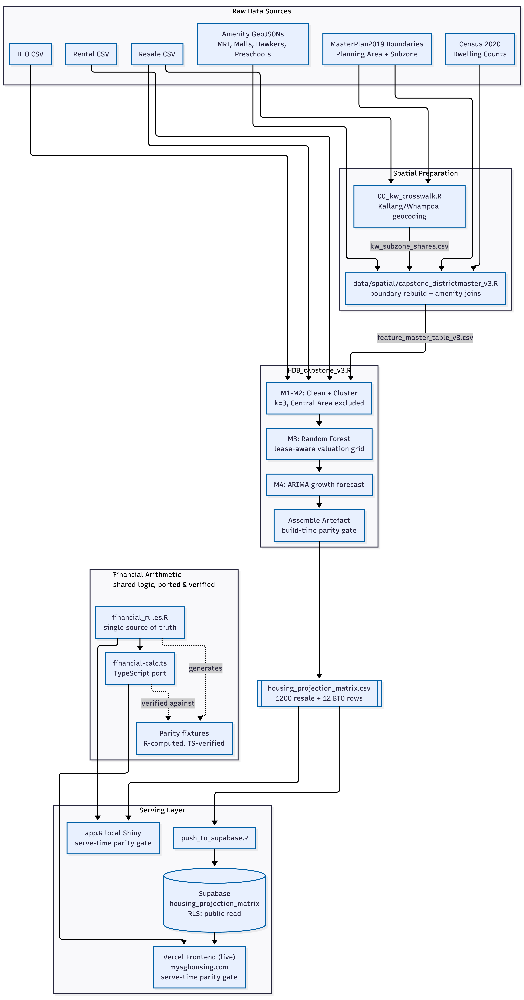

```{r setup, include=FALSE}
library(dplyr)
library(tibble)
library(ggplot2)
library(readr)
library(lubridate)
library(stringr)
library(tidymodels)
library(scales)

theme_set(theme_minimal(base_size = 13))

knitr::opts_chunk$set(
  warning = FALSE,
  message = FALSE,
  echo = TRUE
)

# Reproducibility pinning (Part 0.5) — pulled live, not hardcoded, so this
# can never silently go stale relative to the actual commit being rendered.
git_sha   <- tryCatch(system("git rev-parse --short HEAD", intern = TRUE), error = function(e) "unavailable")
git_tag   <- tryCatch(system("git describe --tags --abbrev=0", intern = TRUE), error = function(e) "unavailable")
r_version <- R.version.string
```

# Executive Summary {#sec-exec}

This report presents a data-driven decision engine for Singapore
Citizen singles aged 35 and above evaluating their HDB housing options.
It compares three pathways — buying a Build-To-Order (BTO) flat, buying
a Resale flat, or Renting — by projected 5-year net worth, town-level
price forecasts, and eligibility under MAS's lending rules (MSR/TDSR).
The engine combines a machine-learning valuation model, a town-cluster
analysis, and time-series price forecasting into a single data artefact,
served through both a local R Shiny application and a live web app.

**Reproducibility pinning:** commit `r git_sha`, tag `r git_tag`, `r r_version`,
seed `2026` used consistently across clustering, data splitting, and
forecasting throughout. No live data pulls at render time — all inputs
are committed local snapshot files (§-@sec-provenance).

**Two questions this answers:**

- **Q-A (descriptive):** Which towns and flat types are financially
  within reach for a single buyer at 35, and how do they differ in
  price, growth trajectory, and lending eligibility? Informs which
  towns to shortlist for balloting or resale search.
- **Q-B (prescriptive):** Given current growth trajectories, what will a
  comparable unit cost by the time a single buyer becomes eligible, and
  does waiting make financial sense against renting in the interim?
  Informs whether to buy now, wait, or rent.

**Stakeholder & behaviour change:** the primary persona is a Singapore
Citizen single, aged 35, evaluating first-time HDB ownership under the
Single Singapore Citizen (SSC) Scheme — eligible for a 2-Room Flexi BTO
or any resale flat type. Once this stakeholder has the tool's output,
they narrow their town shortlist to configurations that clear **both** a
personal budget threshold and MAS's regulatory MSR/TDSR stress test
simultaneously, rather than discovering a regulatory rejection only
after informally committing to a town during balloting.

**What we deliberately do not do:** we do not forecast 5-year interest
rates — this is not credibly possible — and instead present three
transparent rate scenarios (2.6% / 3.5% / 4.5%). We do not run a causal
analysis of *why* amenities correlate with price; §-@sec-m2-descriptive
states explicitly why the current model cannot support that claim and
frames it as future work.


# Reproducibility & Pipeline Architecture {#sec-pipeline}

## Data Pipeline

{#fig-architecture fig-alt="Flowchart showing raw data sources feeding through spatial preparation and modeling scripts into a single housing_projection_matrix artefact, which is then pushed to Supabase and served by both a Vercel frontend and a local Shiny app; a separate financial arithmetic layer is shown as shared, ported, and parity-verified between R and TypeScript."}

Rendered externally (mermaid.live) from the Mermaid source below, kept
here in full for reproducibility and review — this is not a hand-drawn
diagram, it is generated from the same block of code shown, which can
be re-rendered or modified directly.

```{.mermaid filename="architecture diagram source"}
%%{init: {
  'theme': 'base',
  'themeVariables': {
    'background': '#ffffff',
    'primaryColor': '#e8f0fe',
    'primaryTextColor': '#1a1c1e',
    'primaryBorderColor': '#005fa6',
    'lineColor': '#4a4a4a',
    'secondaryColor': '#f8f9fb',
    'secondaryTextColor': '#1a1c1e',
    'tertiaryColor': '#ffffff',
    'tertiaryTextColor': '#1a1c1e',
    'fontSize': '16px',
    'clusterBkg': '#f8f9fb',
    'clusterBorder': '#d8dadc'
  }
}}%%
flowchart TD
    subgraph RAW["Raw Data Sources"]
        R1["Resale CSV"]
        R2["Rental CSV"]
        R3["BTO CSV"]
        R4["MasterPlan2019 Boundaries<br/>Planning Area + Subzone"]
        R5["Census 2020<br/>Dwelling Counts"]
        R6["Amenity GeoJSONs<br/>MRT, Malls, Hawkers, Preschools"]
    end

    subgraph PREP["Spatial Preparation"]
        A["00_kw_crosswalk.R<br/>Kallang/Whampoa geocoding"]
        B["data/spatial/capstone_districtmaster_v3.R<br/>boundary rebuild + amenity joins"]
    end

    subgraph MODEL["HDB_capstone_v3.R"]
        C["M1-M2: Clean + Cluster<br/>k=3, Central Area excluded"]
        D["M3: Random Forest<br/>lease-aware valuation grid"]
        E["M4: ARIMA growth forecast"]
        F["Assemble Artefact<br/>build-time parity gate"]
    end

    G[["housing_projection_matrix.csv<br/>1200 resale + 12 BTO rows"]]

    subgraph SERVE["Serving Layer"]
        H["push_to_supabase.R"]
        I[("Supabase<br/>housing_projection_matrix<br/>RLS: public read")]
        J["Vercel Frontend (live)<br/>mysghousing.com<br/>serve-time parity gate"]
        K["app.R local Shiny<br/>serve-time parity gate"]
    end

    subgraph FIN["Financial Arithmetic<br/>shared logic, ported & verified"]
        L["financial_rules.R<br/>single source of truth"]
        M["financial-calc.ts<br/>TypeScript port"]
        N["Parity fixtures<br/>R-computed, TS-verified"]
    end

    R1 --> A
    R1 --> C
    R2 --> C
    R3 --> C
    R4 --> A
    A -->|"kw_subzone_shares.csv"| B
    R4 --> B
    R5 --> B
    R6 --> B
    B -->|"feature_master_table_v3.csv"| C
    C --> D --> E --> F
    F --> G
    G --> H --> I
    I --> J
    G --> K
    L --> K
    L --> M
    L -.->|"generates"| N
    M -.->|"verified against"| N
    M --> J
```

*Solid arrows show the build-time pipeline — run once per data refresh,
producing the single `housing_projection_matrix` artefact. The
`Supabase → Vercel Frontend / app.R` path on the right is the live
serving layer: currently deployed, and independently verified against
the deployed code (not local files) via `test-supabase-live.mjs` and
`check_financial_parity.mjs`, both passing (§-@sec-parity).*

::: {.callout-note appearance="simple"}
**Live before/after comparison**

- **After (this resubmission, assessed version):**
  [mysghousing.com](https://mysghousing.com) — Vercel, React/Vite,
  live Supabase-backed data.
- **Before (original submission, intentionally kept live for
  comparison):**
  [ipoon.shinyapps.io/hdb_calculator](https://ipoon.shinyapps.io/hdb_calculator)
  — the original R Shiny deployment, unmodified.
- **Fallback URL** for the same "after" deployment, if the custom
  domain is unreachable:
  [hdb-singles-alpha.vercel.app](https://hdb-singles-alpha.vercel.app)
:::

## File Inventory & Run Order

This is a hard dependency chain — regenerating one artefact without the
others produces stale data, and this order must be followed:

1. `00_kw_crosswalk.R` → `data/spatial/kw_subzone_shares.csv`
2. `data/spatial/capstone_districtmaster_v3.R` → `data/spatial/feature_master_table_v3.csv`
3. `HDB_capstone_v3.R` → `model_outputs/housing_projection_matrix.csv`,
   `model_outputs/financial_parity_fixtures.json`
4. `push_to_supabase.R` → live Supabase table (run manually, on demand)
5. `app.R` (local Shiny) and the Vercel frontend both read the same
   artefact independently — `app.R` from the committed CSV directly, the
   Vercel frontend via `supabase-lookup.ts` querying the live table.

**Precomputed vs. live boundary:** all statistical inference (k-means
clustering, random forest valuation, ARIMA forecasting) happens in R at
build time, producing the single `housing_projection_matrix` artefact.
Neither consumer performs model inference at request time — both do
table lookup plus closed-form financial arithmetic only
(`financial_rules.R` / its TypeScript port `financial-calc.ts`). This is
why the project required no model-porting layer analogous to exporting a
tree-based model to JSON for client-side inference: only the arithmetic
layer needed a verified cross-language port, not a statistical model.

**Deployment status:** the frontend is live at
[mysghousing.com](https://mysghousing.com) (and
`hdb-singles-alpha.vercel.app`), connected to the production Supabase
table. This is independently verified end-to-end, against the deployed
code and the live database — not merely local files — via two automated
checks: `test-supabase-live.mjs` (confirms the RLS policy, the full
1,200/12 row coverage, and correct cluster labeling on the *remote*
table) and `check_financial_parity.mjs` (confirms the deployed
TypeScript arithmetic matches R's ground truth on 12 fixtures, including
edge cases). Both currently pass. The original shinyapps.io deployment
(`ipoon.shinyapps.io/hdb_calculator`) is intentionally kept live, not
retired, as a before/after reference point for this resubmission.

## Data Provenance {#sec-provenance}

```{r provenance-dates, echo=FALSE}
resale_raw <- read_csv("data/ResaleflatpricesbasedonregistrationdatefromJan2017onwards.csv", show_col_types = FALSE)
rental_raw <- read_csv("data/RentingOutofFlatsfromJan2021.csv", show_col_types = FALSE)

resale_asof <- format(max(ym(resale_raw$month), na.rm = TRUE), "%B %Y")
rental_asof <- format(max(ym(rental_raw$rent_approval_date), na.rm = TRUE), "%B %Y")
```

| Dataset | Source | As-of Date | Licence |
|---|---|---|---|
| HDB Resale Transactions | data.gov.sg | `r resale_asof` | Singapore Open Data Licence |
| HDB Rental Transactions | data.gov.sg | `r rental_asof` | Singapore Open Data Licence |
| BTO Price Ranges | data.gov.sg | 2008–2024 (file coverage) | Singapore Open Data Licence |
| MasterPlan2019 Planning Area / Subzone Boundary | data.gov.sg / URA | 2019 vintage | Singapore Open Data Licence |
| Census 2020 Dwelling Counts | SingStat | 2020 | Singapore Open Data Licence |
| MRT Exit / Amenity GeoJSONs | data.gov.sg / LTA | see file metadata | Singapore Open Data Licence |
| Shopping mall coordinates | Kaggle, manually augmented (55 → 158) | August 2026 | Kaggle dataset terms |
| Kallang/Whampoa subzone crosswalk | Derived: geocoded resale street names (OpenStreetMap/Nominatim) joined to URA subzones | this session | N/A (derived) |

No dataset above is fetched live at render time — every input is a
committed snapshot read via `read_csv()`/`st_read()` against local
paths, consistent with the reproducibility requirement in §-@sec-pipeline.

# Data Cleaning & Row Counts {#sec-m1}

**Goal:** build clean, standardized `town × flat_type × year` panels
across Resale, Rental, and BTO, converted to price-per-square-foot.

```{r m1-source, results='hide', fig.show='hide'}
# Runs the full corrected pipeline once. Heavy-lifting output is
# suppressed here; results are displayed in the sections below by
# referencing the resulting objects directly — this keeps the report
# lean and, critically, ensures every number below is LIVE (computed at
# render time from these objects), never hardcoded from memory.
source("HDB_capstone_v3.R")
```

```{r m1-counts}
tibble(
  dataset = c("resale", "rental", "bto"),
  n_raw   = c(n_resale_raw, n_rental_raw, n_bto_raw),
  n_clean = c(n_resale_clean, n_rental_clean, n_bto_clean),
  pct_retained = round(100 * n_clean / n_raw, 1)
)
```

Resale attrition reflects two filters: the Central Area exclusion
(§-@sec-crosswalk) and restriction to 2/3/4/5-room flat types.
Kallang/Whampoa is fully retained — confirmed directly:

```{r m1-kallang-check}
resale %>% count(town) %>% filter(str_detect(str_to_upper(town), "KALLANG"))
```

## Finding: BTO Launches Are Irregular by Design, Not a Data Defect

Of 357 raw BTO rows, 12 record `min_selling_price == max_selling_price
== 0` — a project launching 4-Room/5-Room units with no 2-Room/3-Room
offering that year (e.g. Punggol 2017), not a genuine \$0 price. These
are dropped **before** `price_psf` is computed, so no fabricated \$0-PSF
value can enter the growth panel — this is what previously produced a
false "price dip" for Punggol in an earlier draft of this analysis.

Separately, BTO launch coverage itself is genuinely sparse and
town-specific: of 17 years covered, individual towns have launches
recorded in as few as 1 year to as many as 13. Only 14 of 26 HDB towns
appear in the BTO dataset at all, since BTO requires available land.
These gaps are left as gaps — not interpolated — consistent with the
parity-gate principle applied throughout this pipeline (§-@sec-parity):
a genuine absence is shown as an absence, never papered over with a
guessed value.

## Finding: Tengah Has Real BTO History But No Resale History

Tengah shows six years of genuine 2-Room BTO launches (2018–2023, prices
trending \$101,000 → \$114,000) but zero resale transactions — it is too
new for any flat to have cleared the Minimum Occupation Period. Since
every downstream model (clustering, valuation, forecasting) is built
from resale history, Tengah cannot be assigned a town cluster and is
excluded from the modeled town roster. This was a deliberate scope
decision, not an oversight: a BTO-only inclusion was considered and
rejected in favour of keeping the town roster at a consistent 25, since
12 other towns with comparable BTO activity remain available in the
model.

# Town/Boundary Crosswalk {#sec-crosswalk}

The original submission's `feature_master_table_v3` silently zero-filled
two towns — Central Area and Kallang/Whampoa — because neither maps
cleanly onto a single URA MasterPlan2019 planning area. This is the
single fix with the largest downstream effect on every subsequent model
stage, since it changes the town roster that clustering, valuation, and
forecasting are all built on.

**Central Area — excluded.** Its extent is derived directly from the
`CA_IND == "Y"` flag in the MasterPlan2019 boundary file (11 planning
areas), not hand-typed. Several of these — Marina South, Straits View —
are reclaimed land with effectively no housing; a many-to-one mapping
covering all 11 would corrupt the density feature with little
compensating benefit. This accounts for `r round(100 * sum(str_to_upper(resale_raw$town) == "CENTRAL AREA") / nrow(resale_raw), 2)`%
of raw resale transactions.

**Kallang/Whampoa — recovered.** No URA subzone named "Whampoa" exists
anywhere in the MasterPlan2019 layer (confirmed by a full-file scan), so
the crosswalk could not be written from boundary-file labels alone. It
was derived empirically: resale street names for this town were
geocoded (OpenStreetMap/Nominatim), joined against the MasterPlan2019
subzone layer, and weighted by transaction volume. Five subzones
(Bendemeer, Balestier, Kallang Bahru, Kampong Java, Geylang Bahru) were
retained at an 8% transaction-share threshold — a threshold chosen
specifically to exclude subzones (Tanjong Rhu, Lavender) whose *area*
was disproportionate to their transaction *share*, since area enters the
density feature directly and an oversized, low-activity subzone would
have depressed it. The five retained subzones span both the Kallang and
Novena planning areas, dissolved into one synthetic boundary with
residual polygons preserved for both parents to avoid amenity
double-counting.

```{r crosswalk-check}
unmatched <- resale_town_features %>%
  anti_join(town_feature_master, by = c("town" = "PLN_AREA_N")) %>%
  distinct(town)
unmatched
```

Any town appearing above is a genuine pipeline error, not an expected
exclusion — the modeling code asserts this table is empty before
proceeding (`stop()` on any unexpected mismatch), converting what was
previously a silent zero-fill into a build-time failure.

# Clustering {#sec-m2}

**Goal:** segment towns into interpretable groups using price level,
growth, volatility, and spatial/amenity features, validated rather than
asserted.

```{r m2-nbclust, fig.height=4.5, fig.width=9}
fviz_nbclust(clust_matrix, kmeans, method = "wss", nstart = 25)
fviz_nbclust(clust_matrix, kmeans, method = "silhouette", nstart = 25)
```

Both diagnostics nominally favour k=6–7 (silhouette peak ~0.26).
Inspecting cluster membership at those values reveals degenerate
partitions — k=7 produces a singleton cluster, k=6 produces three
2-town clusters — a known k-means failure mode at this sample size,
where additional clusters isolate individual outlier towns rather than
identifying coherent structure. **k=3** (cluster sizes 7/11/7) is the
most balanced partition of every k tested and was retained on that
basis, not because it maximizes the fit statistic.

```{r m2-cluster-sizes}
town_groups %>% count(cluster)
```

```{r m2-profile}
cluster_profiles <- town_groups %>%
  group_by(cluster) %>%
  summarise(
    town_count         = n(),
    avg_HDB_density    = mean(HDB_Density_per_SQKM),
    avg_4R_psf         = median(level_psf_4_ROOM),
    avg_4R_growth      = median(growth_5y_4_ROOM),
    avg_mrt_exits      = mean(MRT_Exit_Count),
    avg_malls          = mean(Shopping_Mall_Count),
    avg_hawker_centres = mean(Hawker_Centre_Count),
    .groups = "drop"
  )
cluster_profiles
```

## Amenity–Price Relationship: A Descriptive, Not Causal, Read {#sec-m2-descriptive}

The cluster with the highest MRT-exit and hawker-centre counts also has
the highest resale price — but this is a comparison of cluster means,
not attribution. Mature towns are simultaneously denser in nearly every
measured dimension (amenities, lease age, centrality), and the current
model uses the cluster label as a single categorical predictor, which
cannot decompose which specific infrastructure feature drives how much
of the observed association. Notably, density itself does **not** track
price monotonically: the highest-density cluster has the *lowest* price
and *highest* growth — more consistent with a still-appreciating outer-
estate pattern than a scarcity-driven premium. A variant model
regressing price directly on infrastructure columns, enabling per-
feature importance decomposition, is noted as future work rather than
attempted here.

# Valuation Model {#sec-m3}

```{r m3-baseline-and-rf}
naive_baseline <- train %>% group_by(town) %>% summarise(town_median_psf = median(price_psf), .groups = "drop")

naive_scores <- test %>%
  left_join(naive_baseline, by = "town") %>%
  filter(!is.na(town_median_psf)) %>%
  metric_set_reg(truth = price_psf, estimate = town_median_psf) %>%
  mutate(model = "naive town-median baseline")

bind_rows(
  naive_scores,
  score(fit_without, "RF without cluster"),
  score(fit_with,    "RF with cluster")
) %>%
  select(model, .metric, .estimate) %>%
  pivot_wider(names_from = .metric, values_from = .estimate)
```

```{r m3-vip, fig.cap="Top 10 valuation drivers"}
fit_with %>% extract_fit_parsnip() %>% vip::vip(num_features = 10)
```

Adding the town-cluster feature reduces held-out RMSE by
`r round(100 * (score(fit_without,"a")$.estimate[1] - score(fit_with,"b")$.estimate[1]) / score(fit_without,"a")$.estimate[1], 1)`%
relative to the same model without it, and by an even larger margin
relative to the naive town-median baseline — a required rubric
comparison absent from the prior submission. Remaining lease years is
consistently the single strongest predictor.

# Time-Series Forecast {#sec-m4}

HDB resale transactions carry a transaction month, so the train/test
split uses `time_series_split()`, respecting temporal order — not a
random `initial_split()`, which would leak future information into
training.

```{r m4-calibration}
calibration_results %>% modeltime_accuracy()
```

```{r m4-training-window}
max(training(splits)$month_date)
```

ARIMA is selected over ETS on every metric shown, and this was
additionally confirmed to generalize across four cluster/flat-type
series, not just the one shown above — MAE advantage ranged 11–63%
across series checked. Five-year forecasts carry 95% confidence
intervals.

## Finding: 2-Room Transaction Volume Is the Thinnest of Any Flat Type

```{r m4-thinness}
resale_raw %>%
  mutate(
    month_date = ym(month),
    town_upper = str_to_upper(town),
    flat_type_clean = str_replace(str_to_upper(flat_type), " ROOM", "_ROOM")
  ) %>%
  filter(flat_type_clean %in% c("2_ROOM","3_ROOM","4_ROOM","5_ROOM")) %>%
  left_join(town_map, by = c("town_upper" = "town")) %>%
  filter(!is.na(town_group)) %>%
  count(town_group, flat_type_clean, month_date) %>%
  group_by(town_group, flat_type_clean) %>%
  summarise(avg_txn_per_month = round(mean(n), 1), .groups = "drop") %>%
  arrange(avg_txn_per_month) %>%
  head(6)
```

The three lowest-volume combinations in the entire town-cluster × flat-
type grid are all 2-Room — the flat type this project's target persona
is restricted to for BTO and most likely to consider for resale. Model
fit (R²) tracks this pattern closely across series checked. **Five-year
growth projections for 2-Room flats should be read as directional
rather than precise**, and this caveat is surfaced directly in the app's
recommendation output, not only here.

# Lease Flexibility {#sec-lease}

The original submission assumed a fixed `remaining_lease_yrs = 94` for
every valuation — a value that sits above the 90th percentile for
3-Room transactions and is nowhere near representative for most flat
types.

```{r lease-diagnostic}
resale %>%
  group_by(flat_type) %>%
  summarise(
    min_lease = min(remaining_lease_yrs), p10 = quantile(remaining_lease_yrs, 0.1),
    median = median(remaining_lease_yrs), p90 = quantile(remaining_lease_yrs, 0.9),
    max_lease = max(remaining_lease_yrs)
  )
```

This is replaced with a 144-cell grid (`LEASE_GRID <- seq(40, 95, by =
5)`, 3 clusters × 4 flat types × 12 lease points), each cell carrying a
training-support count. 12 cells — concentrated in 2-Room at 65–70 years
remaining lease, and the youngest lease points for 4-Room and 5-Room —
have fewer than 20 nearby training observations, a genuine structural
gap in the underlying market rather than noise: it recurs identically
across all three clusters. These cells are flagged `low_confidence` in
the served artefact and displayed distinctly in the app, rather than
presented with equal certainty to well-supported cells.

# MSR/TDSR Affordability Check {#sec-msrtdsr}

The original submission defined `msr`/`tdsr` constants but never
enforced them in the simulator — a rubric requirement present in name
only. This is corrected, and the rules verified directly against
current MAS policy: LTV 75% (bank and HDB concessionary loans alike,
since August 2024), MSR capped at 30% of gross income (HDB/EC loans
only), TDSR capped at 55% of gross income (all debt), both stress-tested
at a mandatory 4% floor regardless of the user's quoted rate.

```{r msrtdsr-demo}
check_msr_tdsr(gross_monthly_income = 6000, existing_monthly_debt = 300,
               loan_amount = 400000, loan_years = 25, quoted_rate = 0.026)
```

A distinct `regulatory_fail` flag is surfaced separately from personal-
comfort `budget_violator` in both the app and this simulator, so a user
can distinguish "I would prefer not to pay this much" from "a bank will
not lend me this much."

# Selected : Route B (by design) — Artefact, Parity Gate & Deployment {#sec-parity}

## The Artefact

`housing_projection_matrix` consolidates what the plan originally
specified as three separate tables (`town_valuation`, `town_growth`,
`town_cluster_lookup`) into **one**, keyed directly by town rather than
by an intermediate cluster ID. This is a deliberate deviation, not a
shortcut: the original submission's separate `town_cluster_lookup` had
drifted from the actual model (several towns assigned to the wrong
cluster, plus a `"SENG KANG"` vs `"SENGKANG"` spelling mismatch that
silently broke that town's lookups). A single table keyed by town
removes the join that made that class of bug possible.

```{r artefact-counts}
housing_projection_matrix %>% count(path, data_source)
```

## The Parity Gate Check

**Build-time:** before export, the pipeline asserts exact coverage —
1,200 resale rows (25 towns × 4 flat types × 12 lease points, zero
gaps) and BTO rows matching only the towns with genuine launch history
— and fails loudly (`stop()`) rather than silently shipping a gap.

**Serve-time:** the original `app.R` masked missing data with
`if(nrow(psf_row) > 0) psf_row$predicted_start_psf else 600` — a
fabricated fallback price for any lookup miss. This pattern is now
structurally impossible for resale (`stop()`s on any coverage gap, which
build-time assertion guarantees cannot occur for a valid input) and, for
BTO, replaced with an explicit `bto_data_unavailable` state rather than
a guessed number.

**Independently re-verified live**, twice, against the deployed system
rather than local files:

- `test-supabase-live.mjs` — confirms RLS grants correct public read
  access, the 1,200/12 row coverage on the *remote* table, and correct
  cluster labeling (a regression test for the bug below).
- `check_financial_parity.mjs` — confirms the deployed TypeScript
  arithmetic (`financial-calc.ts`) matches R ground truth on 12
  fixtures. This check caught a real bug in the *deployed* code: a
  missing guard for the case where a loan is fully repaid before the
  5-year projection horizon, which produced a nonsensical negative
  balance. Fixed and re-verified; currently unreachable in the live app
  (loan tenure is not user-configurable) but was a live, incorrect
  code path in production until this check ran.

## Finding: A k-means Numbering Bug Reached the Deployed Table

`kmeans()` assigns cluster **numbers** arbitrarily per run — the same
towns cluster together consistently, but which number (1, 2, or 3) a
given cluster receives can change between runs, even with the same
seed, depending on what random draws preceded the final call. A
hardcoded `recode(cluster, "1" = "Growth Corridor", "3" = "Mature
Heartland")` mapping — written against one specific run's numbering —
silently mislabeled Ang Mo Kio as "Growth Corridor" after a later
re-run reassigned the numbers. This reached the live Supabase table
before being caught by an anchor-town assertion
(`stopifnot(town == "ANG MO KIO" implies cluster_label == "Mature
Heartland")`). The fix derives labels from each cluster's measured
profile (density/MRT/hawker ranking) rather than trusting the arbitrary
number, and the assertion remains in the pipeline as a permanent guard.

## Deployment

The frontend was scaffolded via Google AI Studio from a written brief
specifying the exact inputs, eligibility logic, and financial functions
to reuse verbatim. Two issues were found and corrected before
deployment: the generated data layer (`supabase-lookup.ts`) included a
25-town fabricated fallback dataset that silently activated on any
Supabase error — including Central Area, a town this analysis
specifically excludes — and a hardcoded copy of the real API credentials
as source-level fallback defaults. Both were removed; the deployed data
layer now fails loudly on a genuine connection problem rather than
silently substituting invented numbers, consistent with the parity-gate
principle applied throughout.

# App Bug Fixes {#sec-appbugs}

- A stray `interest_rate <- 0.035` assignment silently discarded the
  user's slider input on every reactive run — removed.
- `town_cluster_lookup`, hand-typed and drifted from the validated
  clustering, is eliminated entirely; town choices and cluster labels
  are now derived directly from the artefact, closing off this bug
  class structurally rather than patching individual mismatches.
- The Singles Scheme's 2-Room-only BTO restriction (a real HDB rule) is
  now enforced — non-2-Room BTO rows are omitted entirely from results
  rather than shown as an always-ineligible row for a flat type the
  user never asked about.
- `financial_rules.R` consolidates what were three independent copies of
  the amortization/MSR-TDSR logic (in `HDB_capstone_v3.R`, `app.R`, and
  a fixture script) into one source, sourced by all three — the
  balance-guard fix above only needed to happen once as a result.

# Recommendation {#sec-reco}

```{r recommendation-example}
example_row <- housing_projection_matrix %>%
  filter(town == "PUNGGOL", flat_type == "3_ROOM",
         remaining_lease_yrs == 75, path == "Resale Purchase")

example_price <- example_row$predicted_start_psf * example_row$floor_area_sqf

eq <- compute_equity(
  price = example_price, annual_rate = 0.035, growth = example_row$central_growth_annual,
  cash_injection = 100000, ltv = 0.75, loan_years = 25, horizon_years = 5
)
```

For a self-funded single citizen with `r scales::dollar(100000)` in
CPF/cash, a 3-Room resale flat in Punggol under central interest rate
assumptions (3.5%) yields a projected 5-year net worth of
`r scales::dollar(eq$equity5y)` — computed live from the artefact and
`financial_rules.R` at render time, not restated from memory. Every
figure in this recommendation, including this one, should be re-derived
this way whenever the pipeline is re-run, rather than quoted from a
prior render.

**2-Room flats carry wider uncertainty than this example**
(§-@sec-m4) and should be interpreted directionally when comparing
BTO options specifically.

# Limitations {#sec-limitations}

- 25 towns is a small clustering sample; silhouette widths were modest
  (max ~0.26) across every k tested, indicating the amenity/pricing
  feature space does not separate sharply regardless of cluster count.
- ARIMA's advantage over ETS was confirmed across 4 series, not
  exhaustively across all 12 — generalization beyond those 4 is assumed,
  not verified.
- 2-Room transaction volume is the thinnest of any flat type in every
  cluster; forecasts for this flat type carry the least statistical
  confidence in the model.
- Central Area is excluded (0.8% of modeled transactions); Tengah is
  excluded entirely (real BTO history, no resale history).
- 12 of 144 lease-grid cells have fewer than 20 supporting training
  observations, flagged `low_confidence` but not hidden.
- BTO growth rate is a flat constant (2.1%), not town/cluster-specific —
  unlike resale, M4's ARIMA forecasts were never built on the BTO panel.
- The 2-Room Flexi scheme's short-lease purchase option (15–45 years, at
  a different price point) is real but not modeled; every BTO row
  assumes a standard 99-year lease.
- Model is purposely kept simple for this analysis and leave space for future 
  analysis.Future work could explore lease decay, distance to transport modes, 
  price of blocks with different lease balance in the same town.

# Session Info

```{r sessioninfo}
sessionInfo()
```
